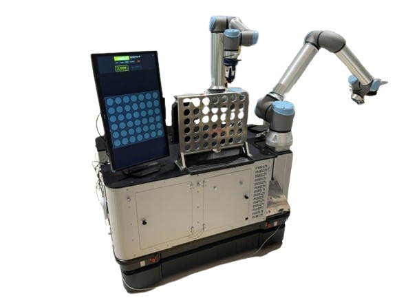

# Schlag den Roboter - Vier gewinnt / Beat the Robot - Connect Four

This repository contains a robot-based version of the classic game **Connect Four**, allowing a human to play directly against a robotic opponent. 

It builds upon the open-source project [connect-four-ai by benjaminrall](https://github.com/benjaminrall/connect-four-ai) and extends it with custom code for the **UR10e robot arm**. While originally designed as a showcase for events like the "Nacht des Maschinenbaus" (Night of Mechanical Engineering) or "Die Nacht die WissenSchaft" (The Night of Science), the setup is perfectly suited for various other exhibitions.

This repository and the documentation below provide all the necessary components and instructions to set up the game quickly and smoothly.

## Step-by-Step Setup Guide

Follow these steps in order to set up the Connect Four game:

### 1. Preparations

Before starting the setup, the following items should be prepared:
- **MuR620d** (check the naming on the back of the mobile robot)
- **Grey Box** (labeled "Schlag den Roboter - Vier Gewinnt")
- **Schunk Gripper** (check for the naming and brand)

### 2. Hardware Assembly

- [Positioning the MuR620](./docs/hardware-setup.md#positioning-the-mur620)
- [Mounting of hardware components](./docs/hardware-setup.md#mounting-of-hardware-components)
- [Cabling and Power Supply](./docs/hardware-setup.md#cabling-and-power-supply)

### 3. Software & Calibration

- [Getting the NUC ready](./docs/hardware-setup.md#getting-the-nuc-ready)
- [Calibrate the Camera for the Game](./docs/hardware-setup.md#calibrate-the-camera-for-the-game)

### 4. Robot Preparation

- [Getting the UR-robots ready](./docs/hardware-setup.md#getting-the-ur-robots-ready)
  - [Move UR10 2 to the Side](./docs/hardware-setup.md#move-ur10-2-to-the-side)
  - [Mount Schunk Gripper to UR10 1](./docs/hardware-setup.md#mount-schunk-gripper-to-ur10-1)

### 5. Launch

- [Start the Game](./docs/hardware-setup.md#start-the-game)
- [Start UR program and move to initial pose](./docs/hardware-setup.md#start-ur-program-and-move-to-initial-pose)

---

## Additional Information

If you run into issues or need to perform basic operations, refer to the following guides:

- **[Basic Skills Guide](./docs/basic-skills.md)**: Covers manual movement, turning the robots on/off, and using the UR user interface.
- **[FAQ](./docs/faq.md)**: Common questions and troubleshooting.

## Documentation

Comprehensive documentation is available in the [`docs/`](./docs/) folder:

- **[Connect Four AI Documentation](./docs/connect-four-ai.md)** - Complete technical documentation of the AI algorithm, performance benchmarks, and implementation details
- **[Software Setup Guide](./docs/software-setup.md)** - Step-by-step instructions for setting up the development environment and installing dependencies
- **[Hardware Setup Guide](./docs/hardware-setup.md)** - Physical setup instructions for robotic implementations and hardware requirements
- **[Basic Skills](./docs/basic-skills.md)** - Basic operations for the robotic system

