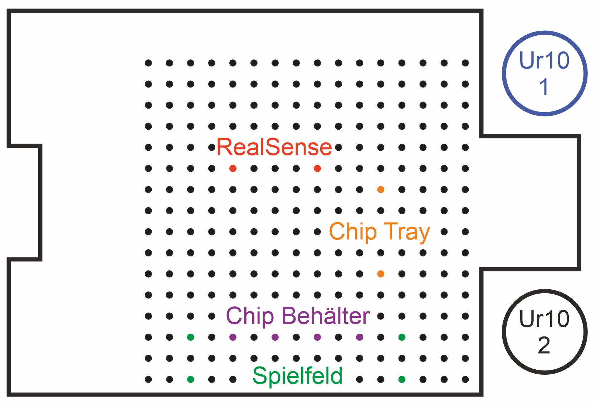
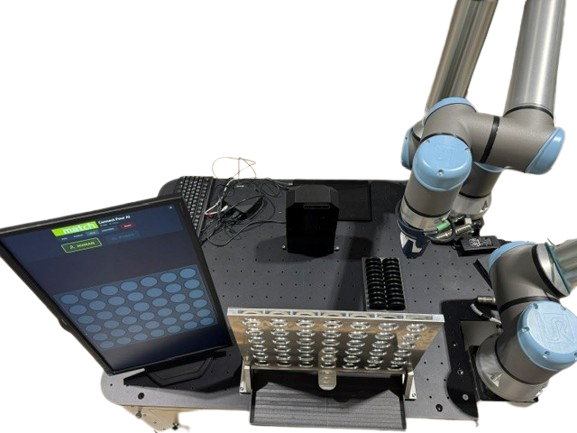
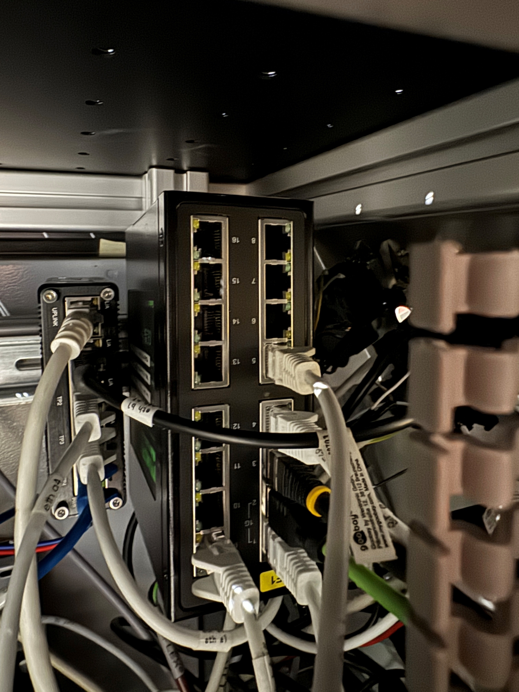
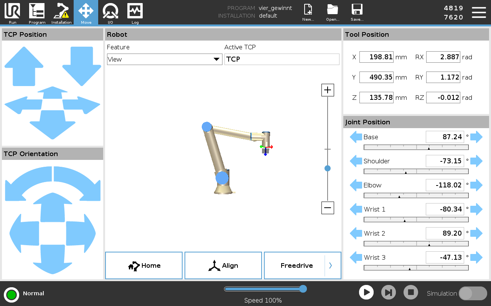
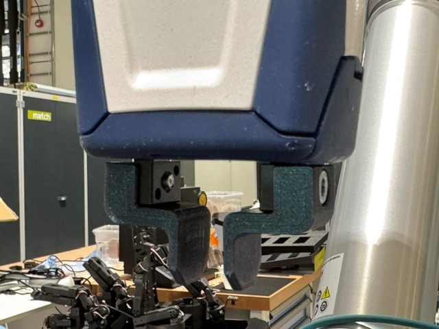
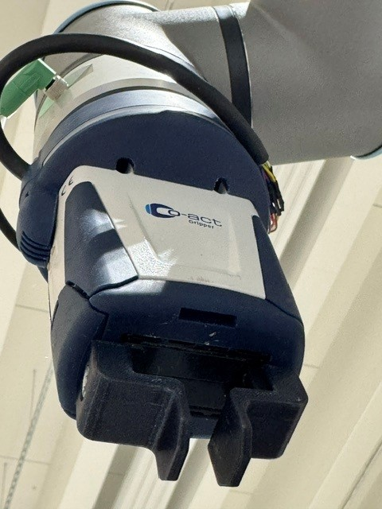

# Hardware Setup

## Positioning the MuR620

The first step is to bring the MuR620 to its designated operating location. This is done by manually moving the robot. For detailed instructions, see: [Manually Moving the MuR620](./basic-skills.md#manually-moving-the-mur620).

**Important Notes Regarding the Location:**
- Avoid placing the setup in front of very bright or overexposed backgrounds, as this may interfere with the camera's image recognition.

[⬆️ Back to Step-by-Step Guide](../README.md#step-by-step-setup-guide) | [➡️ Next Step: Mounting of hardware components](#mounting-of-hardware-components)

## Mounting of hardware components
To ensure the robot program works without modifications, all hardware components **must be mounted at the exact same screw holes**. 
The image below shows a top view of the MuR620 and its mounting grid plate. Please pay attention to the orientation: **the right side of the image is the front** of the robot. **Notice:** There is also a photograph of the real hardware setup further below that you can use to compare and verify your mounting. 



Ideally, you should start counting the holes on the grid plate from the bottom right edge to determine exactly which hole each component should be screwed into. For example, the front screw of the Connect Four board must be fastened in the first row, fourth column from the right.
The components to be mounted on the plate are color-coded as follows:
- 🟢 **Green (Connect Four Board)**: 🚨 **CRITICAL: The surface with the black sticker MUST face the RealSense camera!** 🚨
- 🟣 **Purple (Chip Collection Tray)**: Prevents chips from falling onto the floor when the game board's gate is opened.
- 🟠 **Orange (Black Chip Holder)**: The black chips are placed here in an orderly fashion so the robot can pick them up.
- 🔴 **Red (RealSense Camera Mount)**: The slanted sides must face away from the game board.
- 🔵 **Blue (UR Robot Arm)**: The Universal Robot (UR) arm that is used to play the game.
- 🟩 **Light Green (Difficulty Button)**: Used to set the difficulty. Note: Currently, there is no way to screw this down.
- 🟦 **Dark Blue (Chip Tower)**: Where the green chips for the player are inserted. **Notice:** The outlet for the chips (at the bottom of the tower) should be off the top of the MiR600 facing towards the player, and the screws should be at the back of the tower.



[⬆️ Back to Step-by-Step Guide](../README.md#step-by-step-setup-guide) | [➡️ Next Step: Cabling and Power Supply](#cabling-and-power-supply)

## Cabling and Power Supply

To ensure all hardware components are properly powered and connected, follow these steps:

1. **Prepare Power Supply:** Place a multi-socket extension cord near the MuR620. This will provide power to the MuR620, the NUC (mini PC), and the monitor.
2. **Connect Power Cables:** Retrieve the appropriate power cables from the grey equipment box and plug the MuR620, NUC, and monitor into the extension cord.
3. **Connect Peripherals:** Plug the keyboard and mouse into the USB ports on the NUC.
4. **Connect the Monitor:** Use the provided display cable from the grey equipment box to connect the monitor to the NUC.
5. **Connect to LAN:** Connect the NUC to the LAN of the MuR620. The cable needs to be routed through the back left door of the MiR. Looking in there, you can see the switch which is displayed on the image below.
   
   

6. **Connect the difficulty button:** Connect the difficulty button by plugging the cable into the UR controller. *(Note: Check the plug and the controller ports to find the correct one, as the plug is specific and will only fit into exactly one port.)*

[⬆️ Back to Step-by-Step Guide](../README.md#step-by-step-setup-guide) | [➡️ Next Step: Getting the NUC ready](#getting-the-nuc-ready)

## Getting the NUC ready

Before proceeding, ensure that the [Cabling](#cabling) is completed and all devices are powered on.

1. Turn on the NUC by pressing its power button.
2. When prompted, log in using the password: `match123`.
3. Open a new terminal window.
4. Change into the project directory by running:
   ```bash
   cd connect-four-ai
   ```
   > If the `connect-four-ai` directory does not exist, please refer to the [Software Setup Guide](./software-setup.md) for instructions on how to prepare the environment and clone the repository.

[⬆️ Back to Step-by-Step Guide](../README.md#step-by-step-setup-guide) | [➡️ Next Step: Calibrate the Camera for the Game](#calibrate-the-camera-for-the-game)

## Calibrate the Camera for the Game

Each time the game is set up in a new location, the camera alignment and coin color detection must be calibrated to account for different lighting conditions.

>⚠️ **ATTENTION: Make sure NOTHING is in between the camera and the game.** If necessary, check the camera image.

> **Important:**
> Calibration is iterative. Sometimes you may need to go back to a previous step (e.g., tweaking the RealSense depth settings or board geometry) to get the best results in the final Detection phase. Also, note that the color calibration might need to be tweaked over the play time, as changes in the surrounding light can have a major effect on color detection.

**Start the Calibration Server:**
- Open a terminal and run `pixi run calibrate`.
- Open your web browser and navigate to: [http://127.0.0.1:5000/](http://127.0.0.1:5000/)

1. **Step 1: Define Game Board:**
   - Check if the camera image aligns with the physical game board.
   - If no markers are visible, click in the middle of the four corner holes to define the grid.
   - If markers exist but are misaligned, click near the corners to adjust their position so all 42 holes are correctly aligned.
   - **Note:** Make sure the circles are not too big. Otherwise, the edge of the holes is detected and will lead to errors!
   - Click **Save Corners** when finished.

2. **Step 2: RealSense Calibration:**
   - Switch to the RealSense Calibration tab.
   - Under **Manual Overrides**, ensure the Visual Preset is set to `3` (High Accuracy).
   - Check the depth feed to ensure all empty holes are identified cleanly.
   - If the depth readings are noisy or unsteady, use the **Quick Calibration** tool. (Note: configuring a wider sweep range will take longer). Once complete, it will apply the best hardware settings.
   - Click **Save Profile**.

3. **Step 3: Color Calibration:**
   - Switch to the Color Calibration tab.
   - Place Player 1 and Player 2 stones in the highlighted columns as instructed on the screen.
   - Click **Calibrate Colors** to automatically detect the color profiles.
   - Click **Save Colors**.

4. **Step 4: Detection Calibration:**
   - Switch to the Detection Calibration tab.
   - Test by dropping a few stones into different locations and verifying the system detects them reliably.
   - If open slots are incorrectly marked as closed (or vice versa), adjust the **Occupancy Threshold** and **Temporal Smoothing** until detection is perfectly stable.
   - Click **Save Detection Config**.


**Finish Calibration:**
Once calibration is complete, you can stop the calibration process in the terminal (e.g., by pressing `Ctrl+C`). You can either close the terminal window or leave it open to run the game command later.

[⬆️ Back to Step-by-Step Guide](../README.md#step-by-step-setup-guide) | [➡️ Next Step: Getting the UR-robots ready](#getting-the-ur-robots-ready)

## Start the Game
1. Start the game by executing "pixi run game" in the terminal

[⬆️ Back to Step-by-Step Guide](../README.md#step-by-step-setup-guide) | [➡️ Next Step: Start UR program and move to initial pose](#start-ur-program-and-move-to-initial-pose)

## Getting the UR-robots ready
Only one of the MuR620's robot arms is needed for the game; the other arm must be moved out of the way. In our setup, the UR10 on the left side of the MuR620 is designated as **UR10 1**, and the one on the right side is **UR10 2**.

- **UR10 2** is not needed and must be parked safely to the side.
- **UR10 1** is responsible for playing the game and will be equipped with the appropriate gripper and jaws.

⚠️ **ATTENTION: SD Card Swap**
The SD card in the UR10 1 controller needs to be switched with the one found in the grey box. **This must be done BEFORE powering on the UR controller!** (If it is already on, you must turn it off first). Please put the original SD card on top of the controller for safekeeping, and make sure to insert it back once the game setup is no longer needed!

**Accessing the UR Control Interface**
To view and interact with the UR control interface, you need to plug in one of the touch displays (which can be found somewhere in SCALE). 
1. Connect it via HDMI and USB to the back panel of the MuR620.
2. Once plugged in, the display will show a four-way split screen of multiple devices inside the MuR620. Two of these screens belong to the two UR robots.
3. To actively control a robot and use the touch panel, you must reach inside the back left door of the MuR620 and press the button on the mounted KVM switch. Each press switches the control to the next port.
   > **Tip:** Pay attention to which of the four connections belongs to your UR when you initially turn it on (you will see its loading screen), so you know which port to switch to.


Detailed instructions are provided in the following steps:

1. [Move UR10 2 to the Side](#move-ur10-2-to-the-side)
2. [Mount Schunk Gripper to UR10 1](#mount-schunk-gripper-to-ur10-1)
3. [Start UR program and move to initial pose](#start-ur-program-and-move-to-initial-pose)

[⬆️ Back to Step-by-Step Guide](../README.md#step-by-step-setup-guide) | [➡️ Next Step: Move UR10 2 to the Side](#move-ur10-2-to-the-side)

### Move UR10 2 to the Side

The **UR10 2** [INSERT IMAGE LINK HERE] is not used in the Connect Four game and must be moved out of the way so it doesn't interfere with **UR10 1**.

**Prerequisites:**
1. Make sure the MuR620 is turned on. See: [How to Turn On the MuR620](./basic-skills.md#how-to-turn-on-the-mur620)
2. Make sure the UR is unlocked. See: [Unlocking the UR Robot](./basic-skills.md#unlocking-the-ur-robot)
3. Familiarize yourself with moving the UR manually. See: [Moving the UR Robot](./basic-skills.md#moving-the-ur-robot)

**Steps to move UR10 2:**
1. Access the UR User Interface by switching through the KVM switch and ensure you are controlling **UR10 2**.
2. Use the **Move** tab to jog UR10 2 safely to the side so that its workspace does not overlap with UR10 1.



3. See reference image for a pose that does not interfere with the game
INSERT IMAGE HERE LATER

[⬆️ Back to Step-by-Step Guide](../README.md#step-by-step-setup-guide) | [➡️ Next Step: Mount Schunk Gripper to UR10 1](#mount-schunk-gripper-to-ur10-1)

### Mount Schunk Gripper to UR10 1
1. Look in the grey box for the two gripper jaws.



2. Mount the two gripper jaws to the Schunk gripper.
3. The gripper has an aluminium plate on the back with four diagonal holes. REMOVE IT from the gripper by loosening the four screws on the back. 



4. Mount the aluminium plate directly to the UR10 1 (see the image below).
5. Mount the Schunk gripper to the aluminium plate. Using the diagonal holes going through the Schunk gripper.
   > **Important:** You MUST ensure the gripper is mounted in the correct orientation! Look carefully at the image to match it exactly.

[⬆️ Back to Step-by-Step Guide](../README.md#step-by-step-setup-guide) | [➡️ Next Step: Start the Game](#start-the-game)

### Start UR program and move to initial pose
**Important:** Before proceeding, verify that the correct program and installation are loaded. See: [Load UR Installation and UR program](./basic-skills.md#load-ur-installation-and-ur-program).

1. On the UR touch screen, tap the **"Program"** button in the top left corner.
2. Press the **"Play"** button located in the bottom right corner, then select **"Play from beginning: Robot Program"**.
3. You will be prompted to move the robot to its starting position. 
   - **Caution:** Make sure the robot's path is completely clear of obstacles.
   - Press and hold the **"Move robot to: ..."** button. The robot will move *only* while you are holding the button.
4. Once the robot reaches the start position, a prompt will appear. Tap **"Play from: Robot Program"** to fully start the program. 
   - *Note:* The robot may immediately pick up a stone. This is normal behavior indicating it is successfully connected to the NUC and waiting for commands.

The robot is now actively waiting for TCP commands from the NUC to determine where to place the stones.
**The UR setup is now finished.**

[⬆️ Back to Step-by-Step Guide](../README.md#step-by-step-setup-guide)
