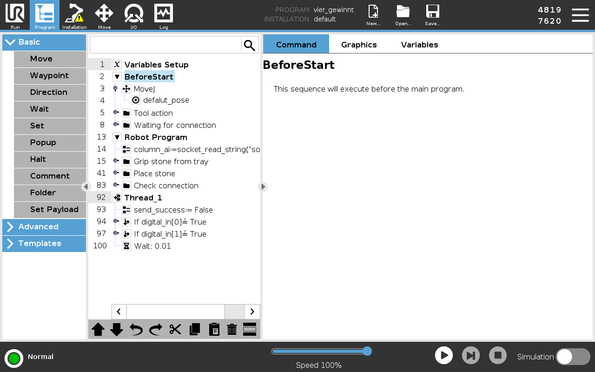
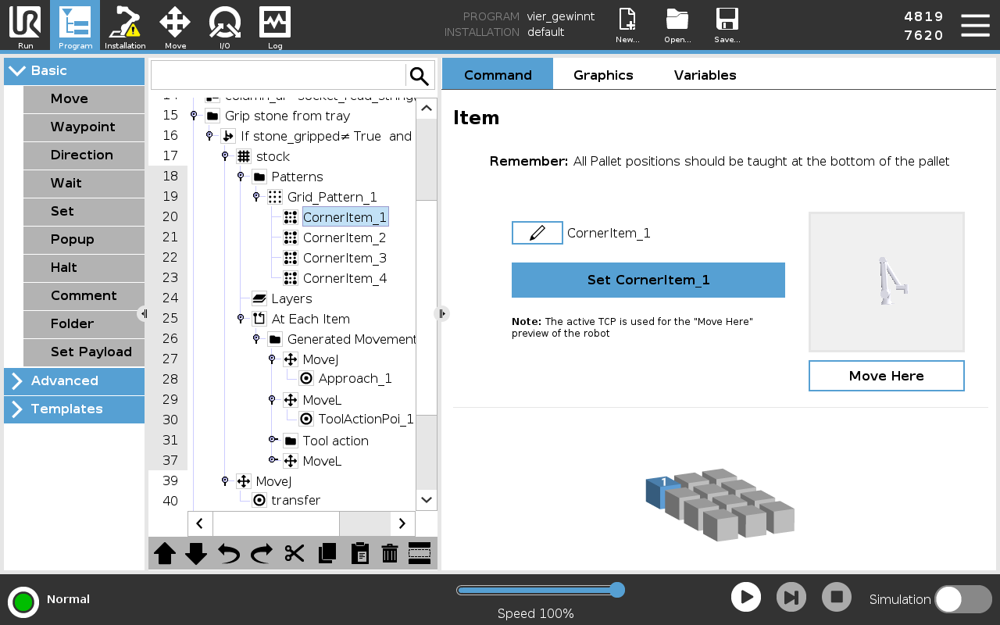
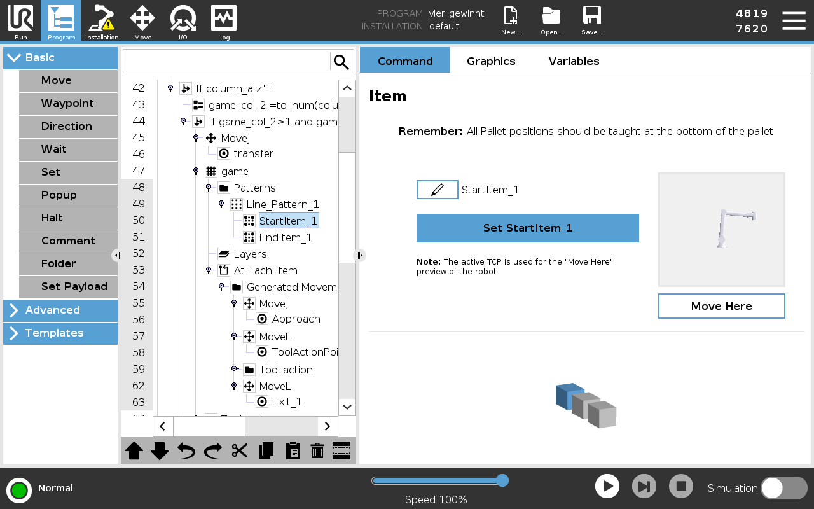
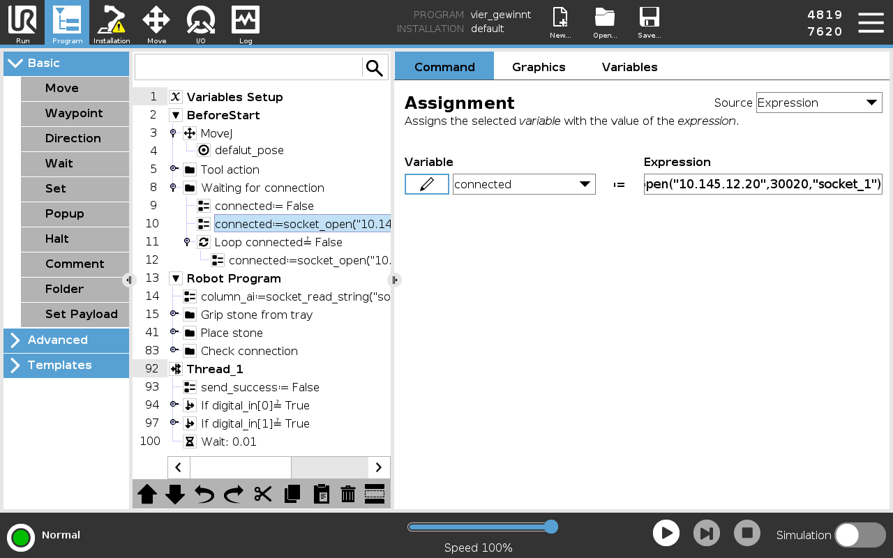
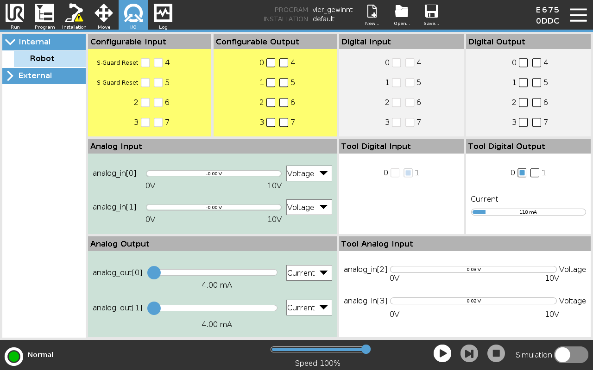

# The UR Robot Program

Reference and debugging guide for **`vier_gewinnt.urp`** — the program running on the UR10.

The NUC does all the thinking: camera, game rules, AI. The robot only receives a column number over TCP and executes the motion. It has no model of the game.

---

## Program structure



| Lines | Block | Function |
|---|---|---|
| 2–12 | **`BeforeStart`** | `MoveJ defalut_pose` (home), `Tool action` (open gripper), `Waiting for connection` (connect to NUC) |
| 13 | **`Robot Program`** | Main loop, one pass per robot move |
| 14 | `column_ai := socket_read_string(...)` | Read of the next command from the NUC |
| 15 | `Grip stone from tray` | Pallet pick from the tray, reports `GRABBED` |
| 41 | `Place stone` | Line pattern drop into the requested column |
| 83 | `Check connection` | Detects a dropped socket and reconnects |
| 92–100 | **`Thread_1`** | Parallel thread polling `digital_in[0]` and `digital_in[1]` every 10 ms |

### Protocol

Single characters and bare words, **no terminators** in either direction.

| NUC → robot | | Robot → NUC | |
|---|---|---|---|
| `1`–`7` | target column | `GRABBED` | holding a token, ready for a column |
| `8` | pick up a token | `EMPTY` | gripper is empty |
| `9` | robot won — celebrate | `TOGGLE` | difficulty button pressed |
| `0` | human won / draw | `RESET` | reset button pressed |

The NUC never assumes what is in the gripper — it only sends a column after a `GRABBED`. Details: [System Overview → The Grab Handshake](./SYSTEM_OVERVIEW.md#the-grab-handshake).

---

## 1. Tray or board moved

Neither the tray nor the board is taught point by point. Both use **Pallet** nodes, so only the extreme points are stored and the rest are interpolated.

### First: move the hardware, not the points

Re-teaching is the last resort. If the tray or the board has been knocked out of place, it is far quicker to **move the hardware back to the robot** than to teach the robot a new position:

1. Loosen the tray or board on the mounting plate, but leave it loose enough to slide by hand.
2. Select a stored point in the program (e.g. `CornerItem_1`, or `StartItem_1` for the board) and hold **Move Here** until the robot is there.
3. Slide the tray or board until the taught pose lines up with it again — the gripper sits centred on the corner token, or centred over column 1.
4. Check a second point (`CornerItem_4` / `EndItem_1`) the same way. Both must fit; if only one does, the part is rotated — pivot it around the first point and check again.
5. Tighten the screws and run a test cycle.

This keeps the whole taught grid valid, and it restores the mounting position the [hardware setup](./hardware-setup.md#mounting-of-hardware-components) assumes. Only teach new points if the hardware physically cannot go back where it was.

### Tray — `Grip stone from tray` (line 15)



`Grid_Pattern_1` with four taught points: **`CornerItem_1` … `CornerItem_4`**. `At Each Item` runs `MoveJ Approach_1` → `MoveL ToolActionPoi_1` → `Tool action` (close) → `MoveL` (lift). The `stock` counter tracks how far through the tray the robot has worked.

If the tray cannot be aligned to the robot, re-teach: select the corner item → **`Move here`** → **`Set CornerItem_n`** → move the TCP to the grab pose → confirm. Repeat for all four — a partially re-taught grid is skewed.

> [!IMPORTANT]
> Teach corners **at token height** 

### Board — `Place stone` (line 41)



`Line_Pattern_1` with two taught points: **`StartItem_1`** (column 1) and **`EndItem_1`** (column 7). Columns 2–6 are interpolated. Guarded by `If column_ai ≠ ""` and a range check on `game_col_2`, so an unparsable message never moves the arm.

Same order here: first try sliding the board so that `StartItem_1` and `EndItem_1` line up over columns 1 and 7 again. Only if that is impossible, re-teach the two points.

Both branches pass through the shared **`transfer`** waypoint (lines 39 / 45). If you re-teach and the arm now takes an odd path between tray and board, `transfer` is the point to check.

### Verifying

**Move Here** (hold to move) sends the robot to a stored point without running the program — use it to check each point individually before a full cycle. Then test columns **1, 4 and 7**: 1 and 7 validate the taught points, 4 validates the interpolation.

| Symptom | Cause |
|---|---|
| Off at all columns by the same amount | Board shifted as a whole → slide it back, or re-teach both end points |
| Correct at 1 and 7, off in the middle | Board not straight or not in the intended mounting holes — neither sliding nor re-teaching the end points fixes this, see [Mounting of hardware components](./hardware-setup.md#mounting-of-hardware-components) |
| Grabs air / presses into the tray | Height mismatch: tray not seated flat, or a corner taught at the wrong height |
| Grabs correctly at first, drifts later in the tray | Tray rotated, or only some corners re-taught; all four must be consistent |

---

## 2. Connection to the NUC fails

Symptom: the program hangs in `Waiting for connection`, or stops mid-game and does not resume.



Line 10, inside `Waiting for connection`:

```
connected := socket_open("10.145.12.20", 30020, "socket_1")
```

Line 11 loops on `connected ≠ False`, so the robot retries indefinitely. **The robot is always the client, the NUC is always the server** — the game software can be started first, but not the other way around.

Work through this in order:

1. **Is the game running on the NUC?** The server only listens once `pixi run game` is up. Nothing to connect to otherwise.
2. **Does the IP match?** Check the NUC's actual address (`ip a`) against the string in line 10. This is by far the most common cause after a network change. Tap the expression field to edit it.
3. **Port `30020`** must match `C4_SERVER_PORT` on the NUC. Do not change it on one side only.
4. **Are both on the same subnet?** Ping the NUC's IP from another machine on the network.
5. **Connection drops mid-game** → `Check connection` (line 83) handles reconnects. If it reconnects in a loop, suspect the cable or a duplicate IP on the network rather than the program.

> [!NOTE]
> The backend accepts one client at a time and replaces the old socket on a new connection. A pendant that reconnects repeatedly shows up in the NUC console as a climbing connection count — useful confirmation that the robot is reaching the server at all.

### Related failures that look like connection problems

| Symptom | Actual cause |
|---|---|
| Connects, but the robot never picks up a token | No `8` received — the game is not in a running state, or waiting on the camera |
| Picks up a token, then stops | Waiting for a column. The AI has not decided yet, or vision has not confirmed the board state |
| Fetches two tokens | Program restarted while already holding one. Stop, remove the token by hand, restart from the beginning |

---

## 3. DIOs do not work

`Thread_1` polls the two buttons in parallel with the main program, which is why they respond during a motion. Verify signals live on the **I/O** tab:



| Panel | Use |
|---|---|
| **Digital Input** `0`, `1` | The two game buttons, read by `Thread_1` |
| **Tool Digital Output** `0` | Schunk gripper — switched by every `Tool action` |
| **Tool Digital Input** | Gripper feedback |
| **Configurable I/O** (yellow) | Safety (`S-Guard Reset`) — do not touch |
| **Analog I/O** | Unused |

### Buttons

Press the button and watch the corresponding `Digital Input` box on the I/O tab:

- **Box does not toggle** → electrical: button, wiring or terminal in the control box. The program is not involved.
- **Box toggles, nothing happens in the game** → the socket is down (see [section 2](#2-connection-to-the-nuc-fails)), or the NUC rejected the message. A `TOGGLE` is ignored by design while a game is in progress; `RESET` is always accepted.

To confirm which button maps to which action, expand the two `If` blocks in `Thread_1` and read the `socket_send_string` inside each.

### Gripper

- Check `Tool Digital Output 0` on the I/O tab while stepping through a `Tool action`.
- **Output toggles, gripper does not move** → air supply or tool cable to the Schunk gripper.
- **Output does not toggle** → the `Tool action` node is not being reached; check the surrounding `If` conditions.

> [!WARNING]
> Output boxes on the I/O tab can be clicked to force a signal. A forced output **stays forced** and will open the gripper mid-cycle. Only use this with the program stopped.

---

[⬆️ Back to Step-by-Step Guide](../README.md#step-by-step-setup-guide) | [Basic Skills](./basic-skills.md) | [System Overview](./SYSTEM_OVERVIEW.md)
